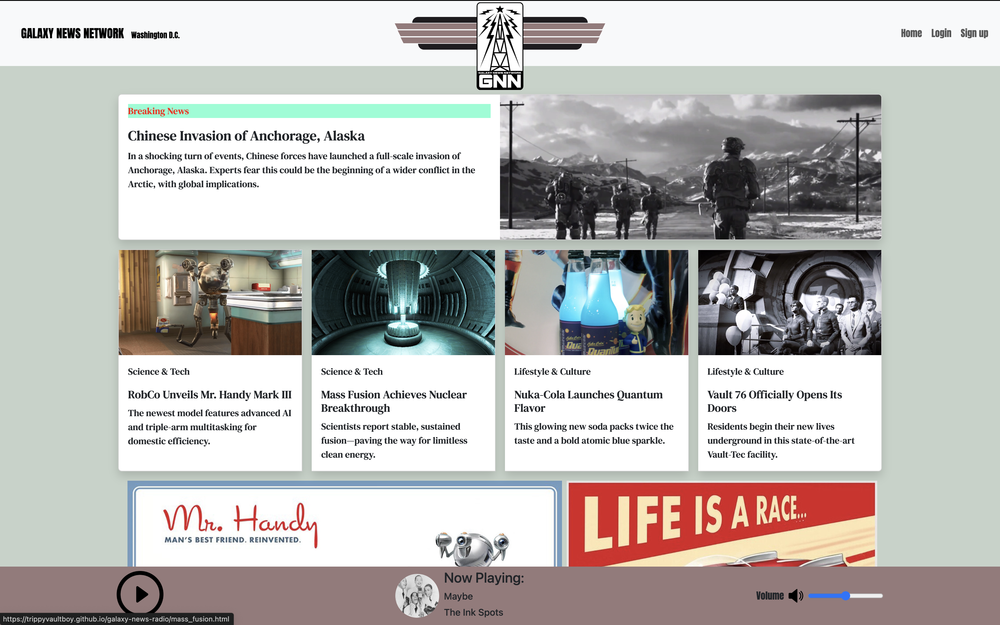
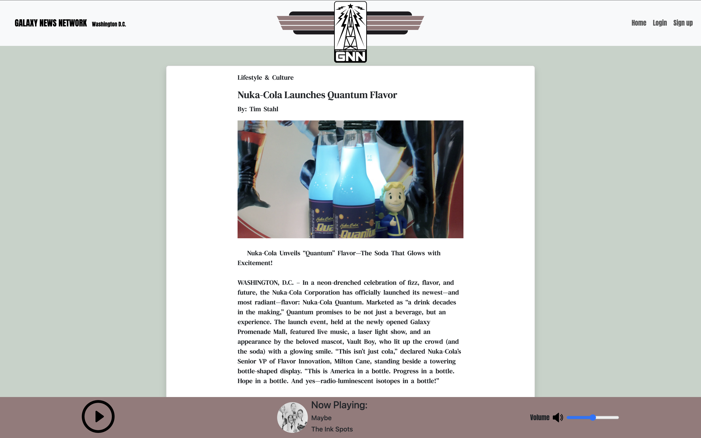

# Galaxy News Network  

  
*Caption: Galaxy News Network Home Page.*  

## About the Developer  

Hi, I’m **Tanner Saint**, a passionate full-stack web developer focused on building clean, efficient, and user-friendly applications.  

- [LinkedIn](https://www.linkedin.com/in/tannersaint/)  
- [Portfolio](https://www.tannersaint.dev/)  

## Project Description  

This project, **Galaxy News Network**, is a frontend for a news station inspired by my favorite game series, Fallout. Galaxy News Network showcases clean, modern web design in an easy-to-read, responsive layout built with Bootstrap. GNN also includes a scratch-built live radio, complete with music and audio files from Fallout 3. This project allowed me to explore frontend development and responsive design with Bootstrap, while also having fun bringing one of my favorite game series into a web experience!

## Tech Stack

- **Frontend:** [HTML, CSS, Javascript, JQuery, Bootstrap]

## The Story of Development  

This project started with a theme **Music** provided for our T3 Final Project.  
During development, I:  
- Designed and planned a rough outline of how the site would look. Inspiration came from the NPR website for the general layout of the news articles as well as Amazing Radio for the live radio controls. Also used the Fallout 3 vinyl soundtrack for the color palette and header logo.
- Faced challenges with audio playback on Apple devices which I solved by converting all audio files from ogg to mp3.  
- Learned how to incorporate audio players and custom controls with HTML and Javascript.  

## Features Implemented  

- Dynamic Home Page  
- Custom audio player and controls complete with a scratch built queueing system  
- Custom built header logo with CSS shapes
- Responsive UI built with Bootstrap  

## Features To Be Implemented  

- Uninterrupted audio on page redirects/refreshes
- Complete backend with article search tools

## Challenges Faced  

The hardest part of this project was:  
- Implementing the custom audio queue system to link music tracks with corresponding intros and outros.

## Screenshots  

  
*An example of an article page*

## Visit the live site
[Visit Galaxy News Network](https://trippyvaultboy.github.io/galaxy-news-radio/index.html)